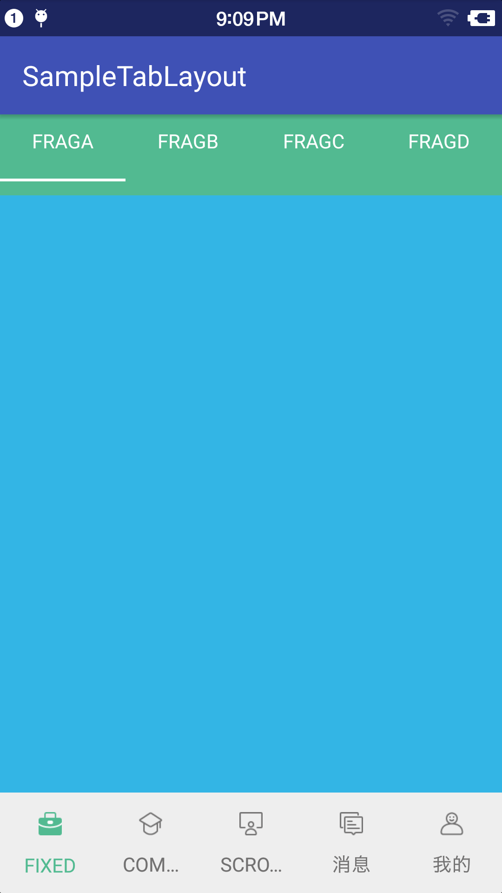
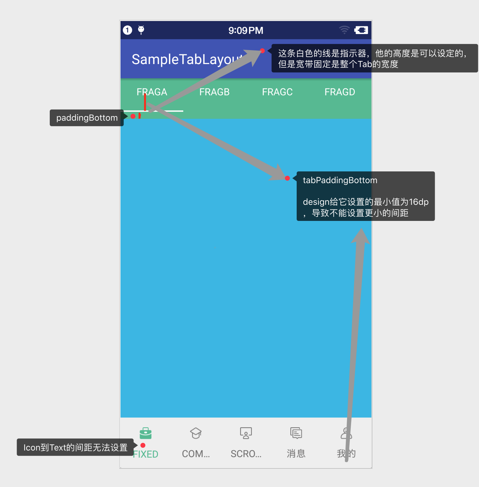
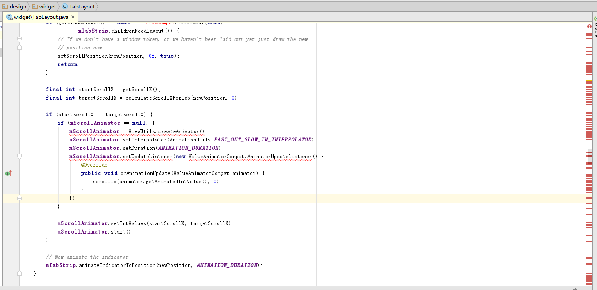
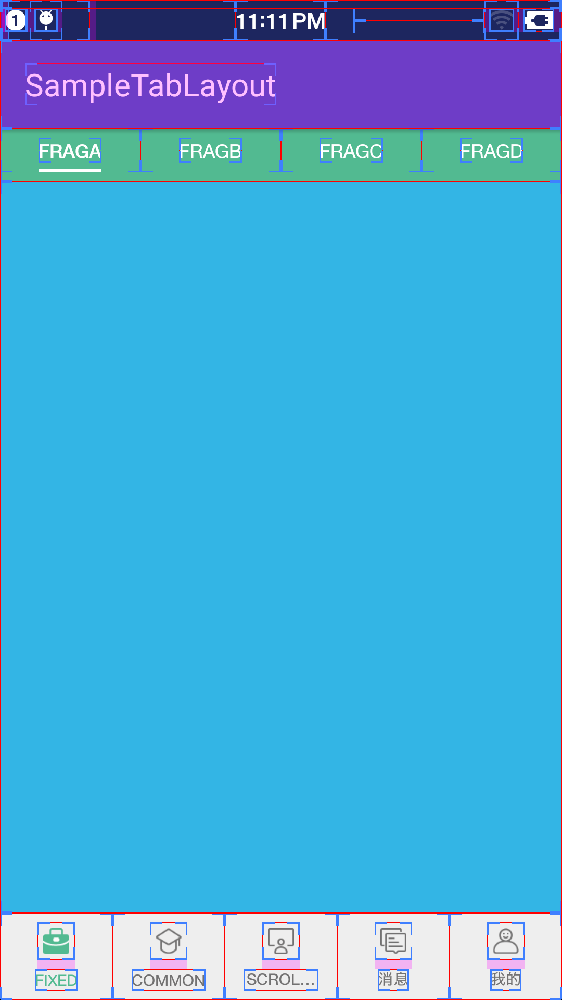
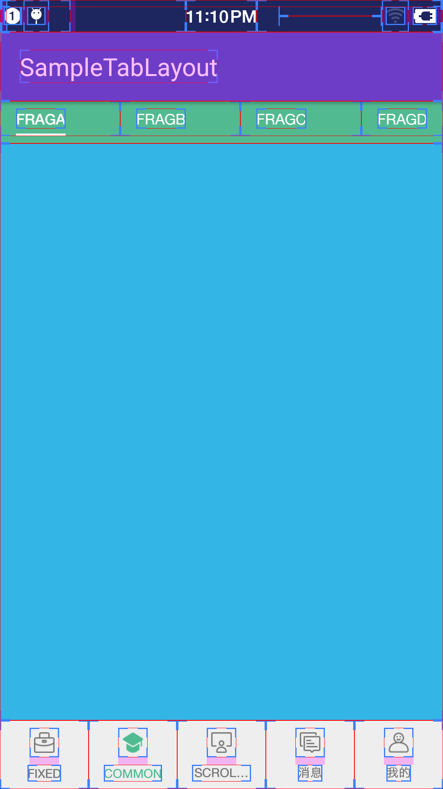
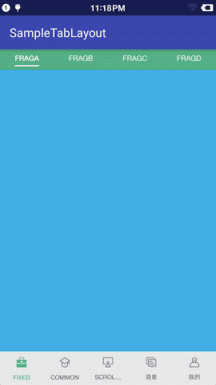

## TabLayout

TabLayout是android design library 中的一个很常用组件，通常是TabLayout + ViewPager + Fragment一起组合使用。
非常强大而且非常简便。
使用2层TabLayout + ViewPager + Fragment组合，很容易实现下图所示的2层Tab嵌套界面，具体实现方法在项目中请自行查看，这里不再赘述
<div align="center" >

</div>
</br>

但是TabLayout有一个比较致命的缺点，我相信你用的过程中肯定也已经发现了，TabLayout有部分规格被限定的很死,比如我们无法自己指定Tab标签的Icon和Text的上下间距，无法设定选中标签文字大小，
无法自定义标签滑动指示器indicator等等.存在这些问题的主要原因是TabLayout的Tab容器是一个私有的内部类SlidingTabStrip,Tab标签也是通过私有内部类TabView实现的,我们无法按照自己项目的需要去扩展Tab标签。
<div align="center" >

</div>
</br>

当然如果你的项目对规格要求不严格，那你可以放心去使用TabLayout。但如果你的项目和我一样每条规格都很明确，android design中的TabLayout肯定不能直接使用。
但我们可以间接去使用它，如何使用呢？

1. 首先将TabLayout.java拷贝到项目中,由于包访问权限限制，拷贝出来的TabLayout会有很多类无法访问，比如ValueAnimatorCompat,ViewCompat等

2. 第二步就是消除这些报错。如使用ValueAnimator替代ValueAnimatorCompat,添加annotation依赖包去除注解报错等等去除所有报错情况。
3. 最后，你可以随心所遇的将TabLayout修改成你想要的效果。

该项目中的TabLayout就是我在android design library的TabLayout基础上加工而来，两者用法基本一致，区别如下：

1. 修改了指示器显示方式：
	design:   位于Tab底部，默认不显示，宽度为整个Tab的宽度
	my    :   位于Tab底部，默认不显示，宽度为Tab中TextView的宽度，可以通过设置TextView宽度为match_parent将指示器宽度设置为整个Tab的宽度，也可以通过添加TextView的padding增加指示器的长度

2. 修改了页面切换时或ViewPager滑动时指示器的动画
   修改动画主要是因为修改1中修改了指示器的显示方式

3. 添加了一个TabMode -> MODE_FIXED_COMMON
   TABLAYOUT原来有MODE_FIXED, MODE_SCROLLABLE 2种模式,除这两种模式外,我又添加一个MODE_FIXED_COMMON模式，MODE_FIXED_COMMON是在MODE_FIXED基础上做了一些修改，且MODE_FIXED和MODE_FIXED_COMMON并存

   <div align="center">
    <div width="50%">
       
       <p>MODE_FIXED模式</p>
    </div>
    <br>
    <div width="50%">
       
       <p>MODE_FIXED_COMMON模式</p>
    </div>
   </div>

   两者的区别在于,MODE_FIXED模式中所有的Tab标签文字都是相对于Tab居中的,
   而MODE_FIXED_COMMON模式的第一个Tab文字和左边界对齐，最后一个Tab和右边界对齐，Tab与Tab之间间隙相等。


4. 去除了一些固定常量，这些常量将控件之间的间隔限制死了,导致控件不够灵活,如前面第二个图中所示tabPaddingBottom设置的最小值16dp

5. 添加了几个自定义属性attrs，使用方式和design TabLayout中其他属性一致，但是AS不会有自动提示
```
    <declare-styleable name="TabLayout">
        <attr name="tabTextSize" format="dimension" />

        <attr name="tabSelectedTextSize" format="dimension" />

        <attr name="tabTextStyle">
            <flag name="normal" value="0" />
            <flag name="bold" value="1" />
            <flag name="italic" value="2" />
        </attr>

        <attr name="tabSelectedTextStyle">
            <flag name="normal" value="0" />
            <flag name="bold" value="1" />
            <flag name="italic" value="2" />
        </attr>
    </declare-styleable>
```

```
<LinearLayout xmlns:android="http://schemas.android.com/apk/res/android"
    xmlns:app="http://schemas.android.com/apk/res-auto"
    android:layout_width="match_parent"
    android:layout_height="match_parent"
    android:orientation="vertical">

    <com.yjs.android.view.tablayout.TabLayout
        android:id="@+id/tab_layout"
        android:layout_width="match_parent"
        android:layout_height="wrap_content"
        android:layout_weight="0"
        android:paddingLeft="@dimen/common_width_3"
        android:paddingRight="@dimen/common_width_3"
        android:paddingBottom="@dimen/common_height_6"
        app:tabPaddingTop="@dimen/common_height_6"
        app:tabPaddingBottom="@dimen/common_height_6"
        app:tabPaddingStart="@dimen/common_width_13"
        app:tabPaddingEnd="@dimen/common_width_13"
        app:tabBackground="@null"
        app:tabTextColor="@color/white"
        app:tabSelectedTextColor="@color/white"
        app:tabTextSize="@dimen/common_title_size14"
        app:tabSelectedTextSize="@dimen/common_title_size16"
        app:tabTextStyle="normal"
        app:tabSelectedTextStyle="bold"
        app:tabIndicatorColor="@color/white"
        android:background="@color/green_52ba91"
        />

    <com.yjs.android.view.viewpager.FixedViewPager
        android:id="@+id/viewpager"
        android:layout_width="match_parent"
        android:layout_height="match_parent"
        android:layout_weight="1" />
</LinearLayout>
```

#### 最终效果




